# 🎁 HONGMART
A completely customized eCommerce / shopping cart application.
* Full featured shopping cart

* Product reviews and ratings

* Top products carousel
  
* Product pagination
  
* Product search feature

* User profile with orders

* Admin product management
 
* Admin user management
 
* Admin Order details page
 
* Mark orders as delivered option
 
* Checkout process (shipping, payment method, etc)
 
* PayPal / credit card integration
 
 
 
 
# 🤼‍ Tech Stack
 

        

 
 
 
 

<h1>🔥 DEMO</h1>
 

## Display top-rated products in slideshow
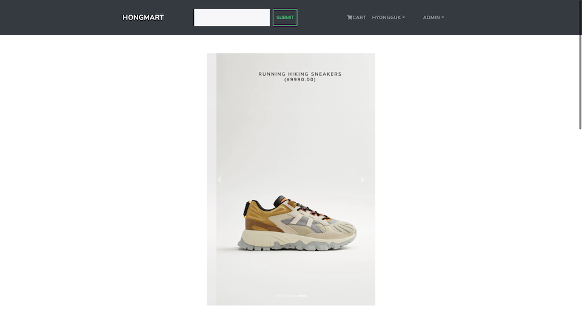

 
 
 
 
 
 
 

## List all the products registered
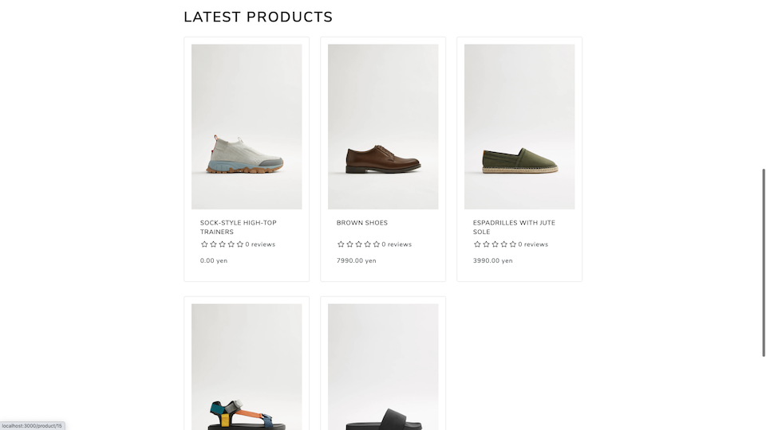

 
 
 
 
 
 
 

## Display a product detail

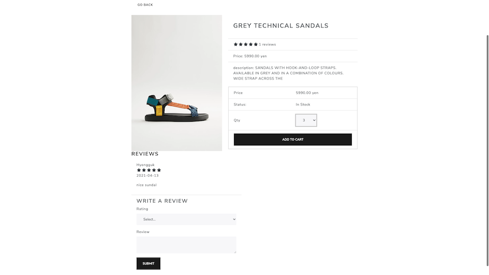

 
 
 
 
 
 
 

## You can see products added to a cart

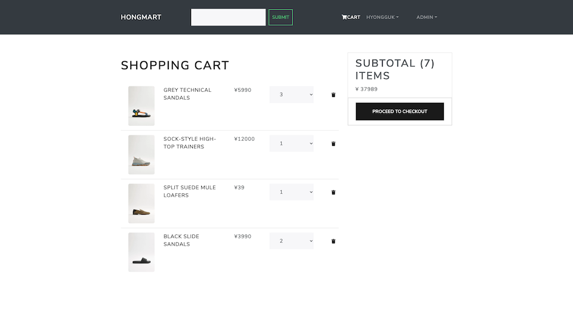

 
 
 
 
 
 
 

## Checkout steps

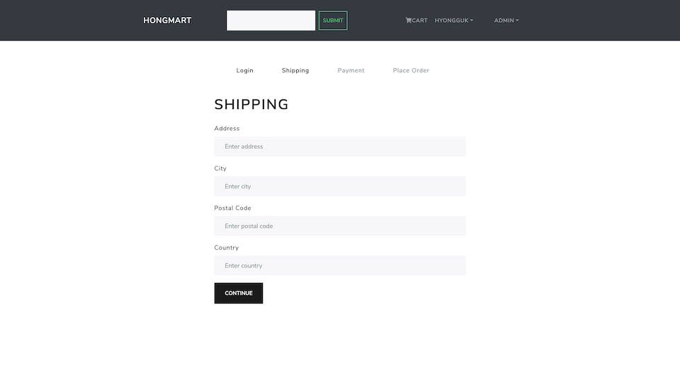

 
 
 
 
 
 
 

## Place Order page

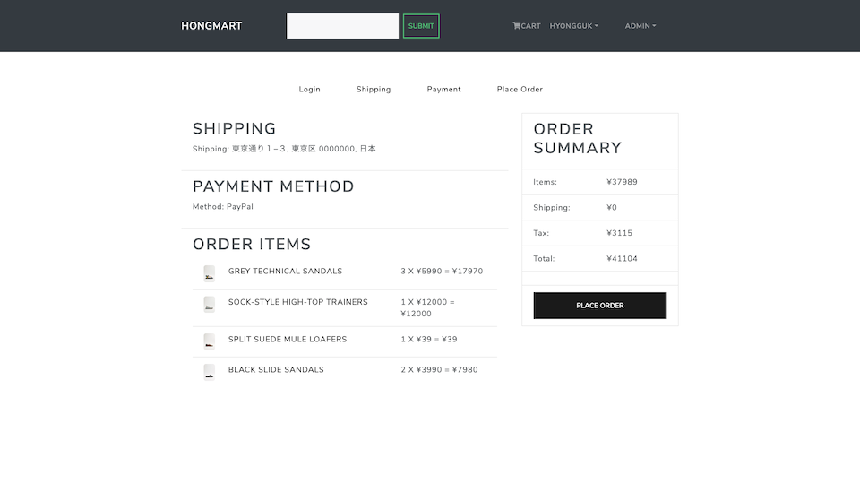

 
 
 
 
 
 
 

## Payment page using PayPal API

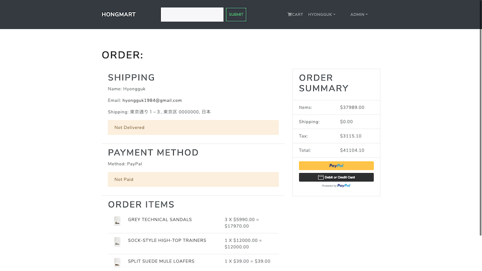

 
 
 
 
 
 
 

## Search by keywords

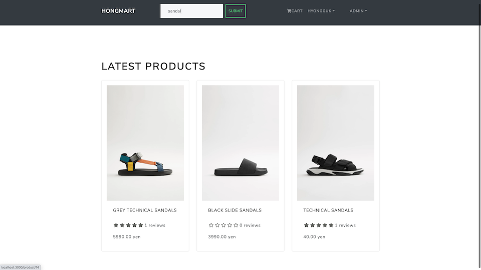

 
 
 
 
 
 
 

## User with authority can check all the orders

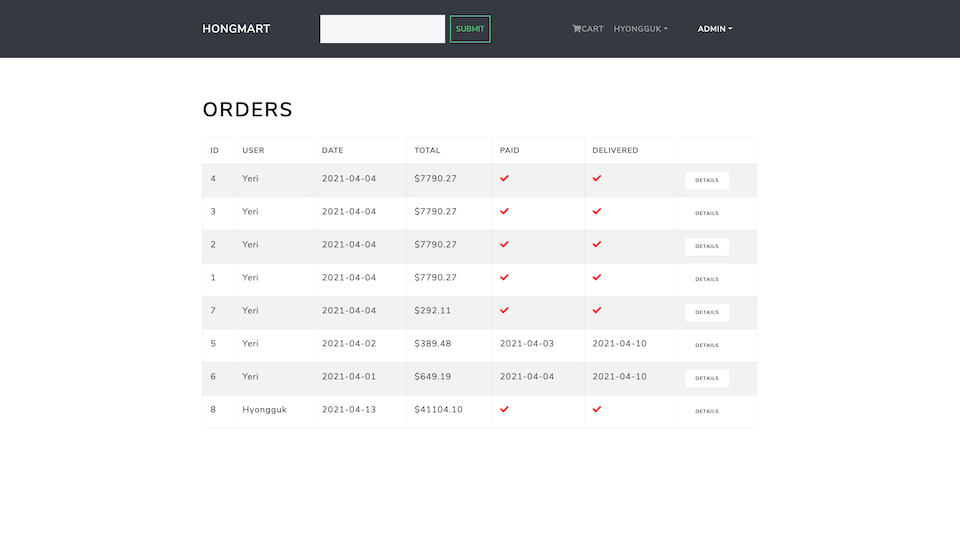

 
 
 
 
 
 
 

## User with authority can edit data of users

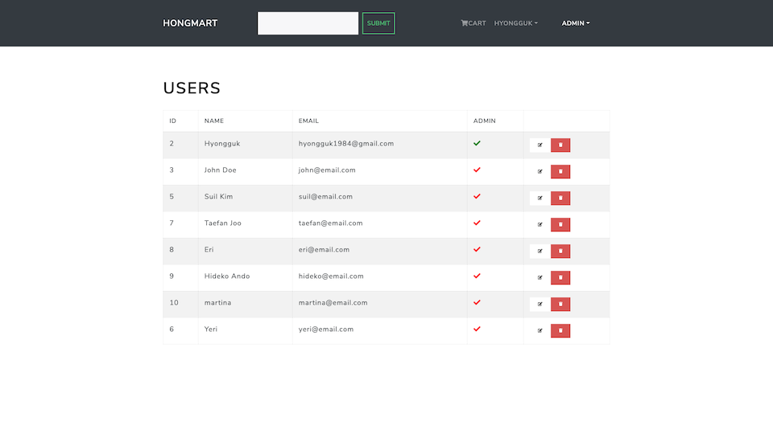

 
 
 
 
 
 
 

## Add or edit a product from an admin page

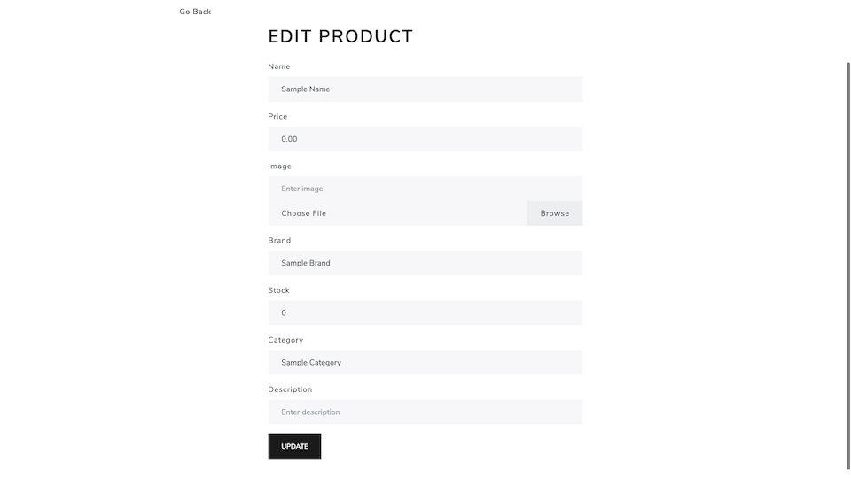

 
 
 
 
 
 
 

## Review procuts you bought

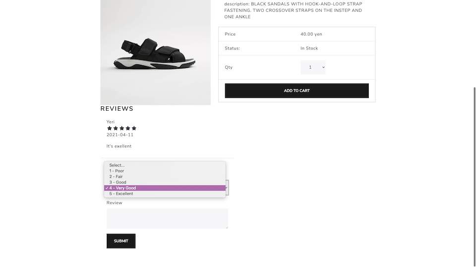

 
 
 
 

# 🚀 Back End Sturucture
 

## Database schema

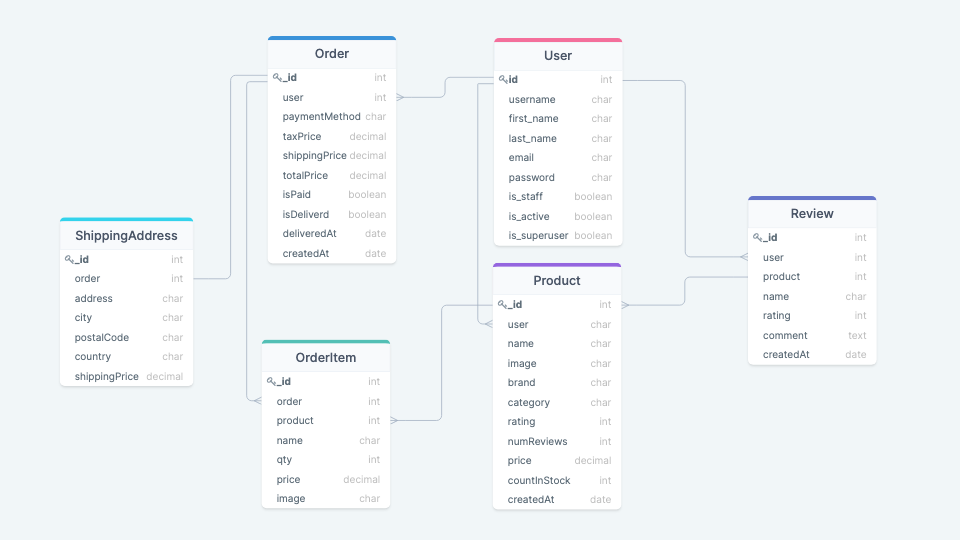

 
 
 
 

## REST API

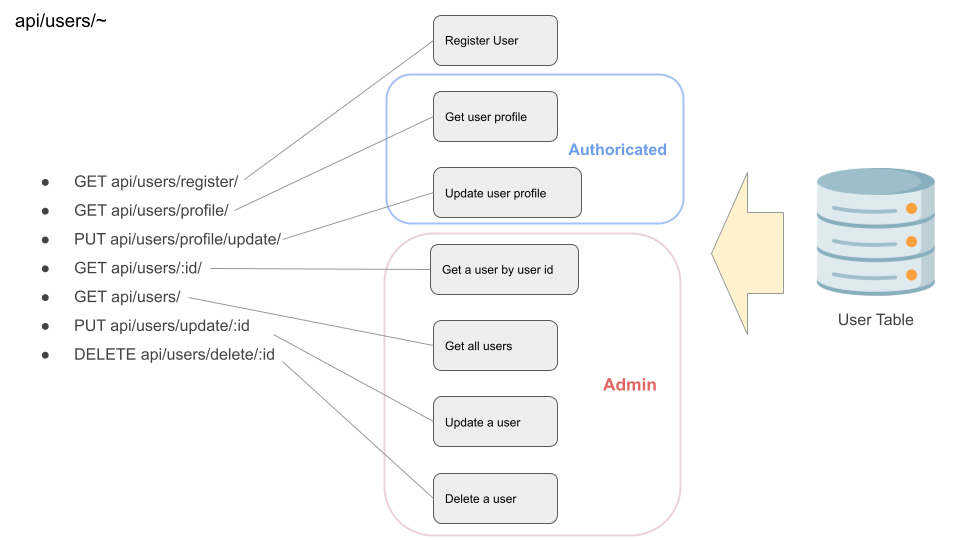
 
 
 
 
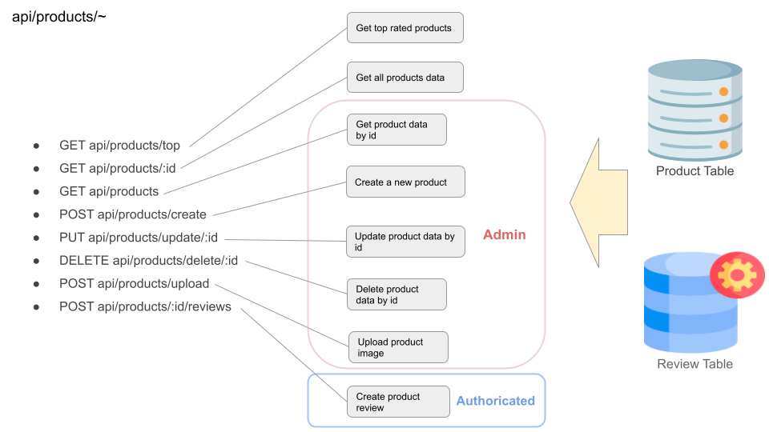
 
 
 
 
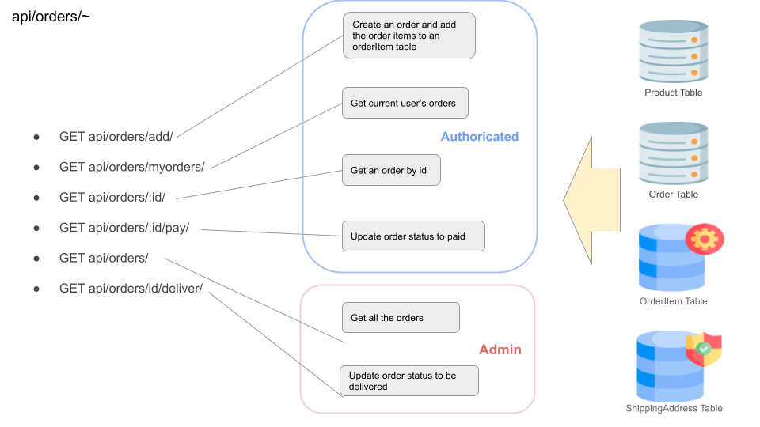

